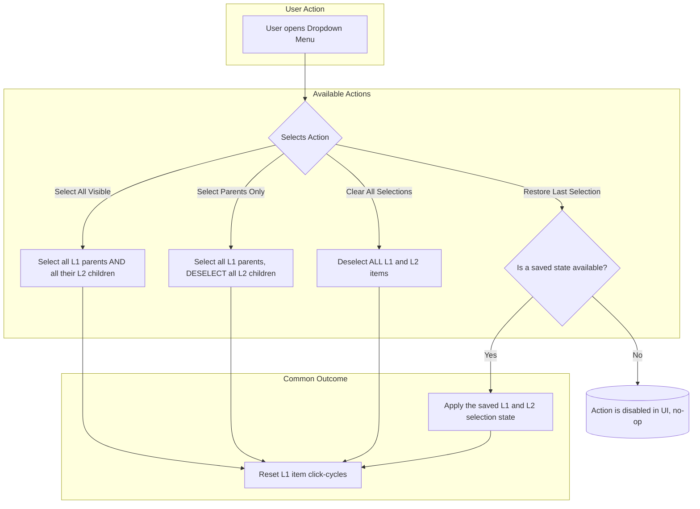

```mermaid
graph TD
subgraph "Initial Click"
Start[User single-clicks an L1 Item] --> CheckSaved{Has a custom L2<br/>selection been saved<br/>for this specific L1 item?};
end

    subgraph "Cycle Path"
        %% The "Happy Path" for items without a saved state
        CheckSaved -- No --> AllSelected[<b>State 1: All Selected</b><br/>Parent (L1) is selected<br/>All children (L2) are selected<br/>Children are visible];

        %% The special entry-point for items WITH a saved state
        CheckSaved -- Yes --> Restore[<b>State 0: Restore Saved</b><br/>Parent (L1) is selected<br/>Saved children (L2) are selected<br/>Children are visible];

        %% The rest of the cycle is linear
        Restore --> NextClick1{Next click};
        AllSelected --> NextClick1;

        NextClick1 --> ParentOnly[<b>State 2: Parent Only</b><br/>Parent (L1) is selected<br/>Children (L2) are de-selected<br/>Children are still visible];
        ParentOnly --> NextClick2{Next click};

        NextClick2 --> Hidden[<b>State 3: Hidden</b><br/>Parent (L1) is selected<br/>Children (L2) are hidden];
        Hidden --> NextClick3{Next click};

        NextClick3 --> Unselected[<b>State 4: Unselected</b><br/>Parent (L1) is de-selected<br/>Children (L2) are de-selected<br/>Children are hidden];
    end

    %% Loop back to the start of the decision
    subgraph "Loop"
       Unselected --> CheckSaved;
    end
```
